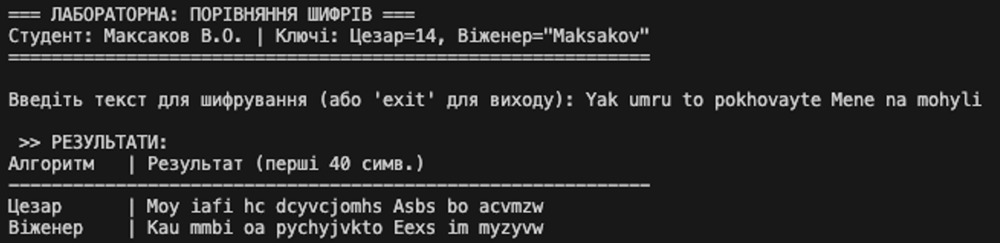
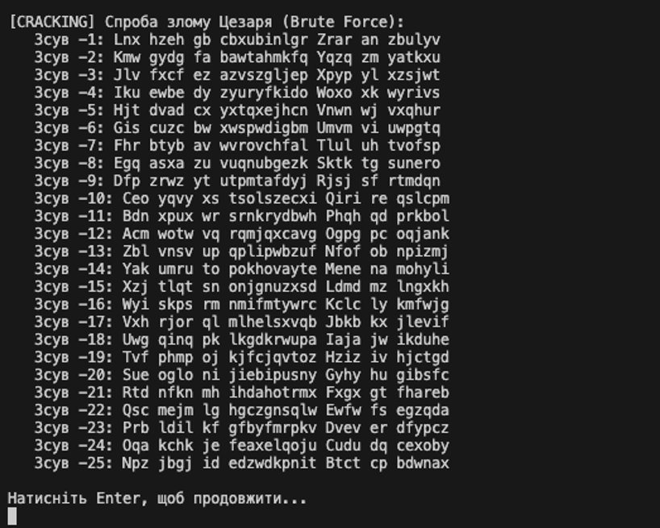

# Application_and_data_security_LR2
## Порівняння шифрів Цезаря та Віженера

Цей проект є практичною частиною лабораторної роботи з дисципліни "Безпека програм та даних". Програма демонструє роботу двох класичних алгоритмів шифрування, виконує їх порівняльний аналіз та демонструє вразливість шифру Цезаря до атаки методом перебору (Brute Force).

## 📋 Функціональні можливості

* **Автоматична генерація ключів** на основі персональних даних:
    * *Цезар:* Сума цифр дати народження.
    * *Віженер:* Прізвище студента (латиницею).
* **Шифрування тексту** обома алгоритмами одночасно.
* **Інтерактивний інтерфейс:** Можливість вводити довільну кількість рядків для тестування без перезапуску.
* **Табличне відображення** результатів для зручного порівняння.
* **Модуль криптоаналізу:** Демонстрація злому шифру Цезаря методом Brute Force (виведення всіх можливих варіантів зсуву).

## ⚙️ Технічні вимоги

Для запуску проекту необхідно мати встановлене наступне програмне забезпечення:
* **.NET SDK** (версія 6.0, 7.0 або новіша).
* Середовище розробки (**Visual Studio 2022**, **VS Code**) або звичайна консоль/термінал.

## 🚀 Інструкція із запуску

### Спосіб 1: Через Visual Studio
1. Відкрийте файл рішення `.sln` або файл проекту `.csproj` у Visual Studio.
2. Натисніть кнопку **Start** (або клавішу `F5`).
3. Консоль відкриється автоматично.

### Спосіб 2: Через термінал (VS Code / PowerShell / CMD)
1. Відкрийте папку з проектом у терміналі.
2. Виконайте команду запуску проекту.

## 📸 Результати роботи

Нижче наведено приклади роботи програми з тестовими даними.

### 1. Головне меню та введення тексту

### 2. Демонстрація Brute Force атаки

## 🧮 Алгоритм генерації ключів

У програмі використано наступні параметри згідно з варіантом:

| Алгоритм | Вхідні дані | Логіка розрахунку | Результат (Ключ) |
| :--- | :--- | :--- | :--- |
| **Цезар** | 05.03.2004 | `0+5+0+3+2+0+0+4` | **14** |
| **Віженер** | Maksakov | Використовується як рядок | **"Maksakov"** |

## 👨‍💻 Автор

**Студент:** Максаков Владислав Олександрович
**Група:** 6.04.121.013.22.2
**Рік:** 2026